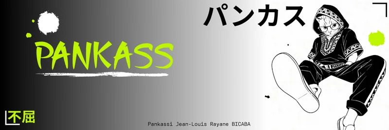
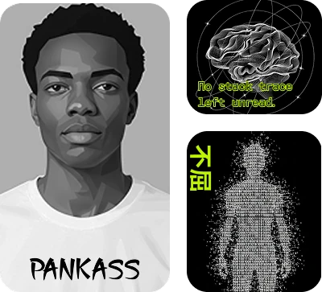

  

 
 

  
  <strong style="font-size: 1.5em; vertical-align: middle;"> About Me </strong>
  

 

<table width="100%">
<tr>
<td width="35%" valign="top" align="center">
  
</td>
<td valign="top">
  
    
  Tinkerer at heart. Breaks things to understand them, builds things to test the limits. 
  No stack trace left unread. 
  Curious by default not boxed into a title, not defined by a role. Drawn to what's elegant and robust, whether it's backend, frontend, or AI.  
  <code>while(true) { fail(); learn(); rebuild(); }</code>
</td>
</tr>
</table>

 
 

  
  <strong style="font-size: 1.5em; vertical-align: middle;"> Stack & Stats </strong>
  

 

<table width="100%">
<tr>
<td width="50%" valign="top">

**Core Stack**

**Also Comfortable With**

</td>
<td width="50%" valign="top" align="center">

</td>
</tr>
</table>

 
 

<table width="100%">
<tr>
<td width="50%" valign="top" align="center">

</td>
<td width="50%" valign="top" align="center">

</td>
</tr>
</table>

 
 

  

